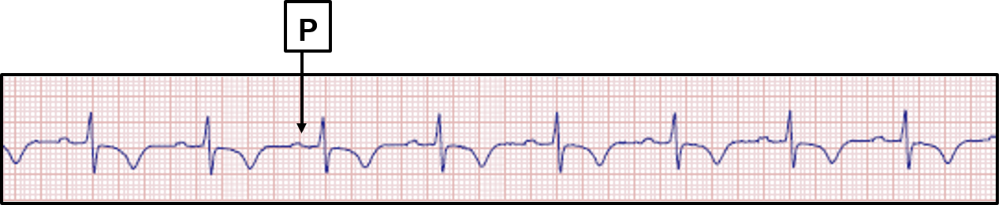
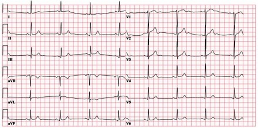

# INICIO
<!-- .slide: id="inicio" -->
<!-- .slide: title="Inicio" -->
Prueba de interpretación 

electrocardiograma (ECG)
<i class="fa-solid fa-heart-pulse"></i>

<a href="#/frecuencia-cardiaca">
    

        <button class="button-start" role="button">EMPEZAR</button>
    

</a>

---

# FRECUENCIA CARDÍACA
<!-- .slide: id="frecuencia-cardiaca" -->
<!-- .slide: title="Frecuencia cardíaca" -->

¿Cuál es la frecuencia cardíaca del ECG?

<a href="#/ondas-p-1">
    <input type="button" value="BRADICARDIA (<60)" class="button-options button-spacing" role="button">
</a><input type="button" value="NORMAL (60-100)" class="button-options button-spacing" role="button"><input type="button" value="TAQUICARDIA (>100)" class="button-options button-spacing" role="button">

---

# ONDAS P
<!-- .slide: id="ondas-p-1" -->
<!-- .slide: title="Ondas P 1" -->

¿Existen ondas P?

<a href="#/ondas-p-2">
    <input type="button" value="SÍ" class="button-options button-spacing" role="button">
</a><input type="button" value="NO" class="button-options button-spacing" role="button">

---

# ONDAS P
<!-- .slide: id="ondas-p-2" -->
<!-- .slide: title="Ondas P 2" -->

¿Hay alguna onda P que no conduce a un QRS?

&thinsp;  <!-- .element height="250px" --> &thinsp;

<a href="#/intervalo-pr-1">
    <input type="button" value="SÍ" class="button-options button-spacing" role="button">
</a><a href="#/intervalo-pr-2">
<input type="button" value="NO" class="button-options button-spacing" role="button">
</a><a href="#/bloqueo-av-3-grado-completo">
    <input type="button" value="NO HAY RELACIÓN ENTRE P Y QRS" class="button-options button-spacing" role="button">
</a>

---

# INTERVALO PR
<!-- .slide: id="intervalo-pr-1" -->
<!-- .slide: title="Intervalo PR 1" -->

¿Cuánto mide el intervalo PR?

<!-- src: https://fontawesome.com/icons/lightbulb?f=classic&s=solid -->
<button class="button-tips button-spacing" role="button">
    <i class="fa-solid fa-lightbulb"></i>
</button>

    <h3><b>Nota</b><h3>
    <h4>Se considera una elevación de ST un desnivel de 2 cuadraditos pequeños respecto a línea basal del ECG</h4>

&thinsp;  <!-- .element height="250px" --> &thinsp;

<a href="#/bloqueo-av-2-grado-mobitz-2">
    <input type="button" value="CONSTANTE" class="button-options button-spacing" role="button">
</a>
<a href="#/bloqueo-av-2-grado-mobitz-1">
    <input type="button" value="SE ALARGA PROGRESIVAMENTE" class="button-options button-spacing" role="button">
</a>

---

# INTERVALO PR
<!-- .slide: id="intervalo-pr-2" -->
<!-- .slide: title="Intervalo PR 2" -->

¿Cuánto mide el intervalo PR?

<!-- src: https://fontawesome.com/icons/lightbulb?f=classic&s=solid -->
<button class="button-tips button-spacing" role="button">
    <i class="fa-solid fa-lightbulb"></i>
</button>

    <h3><b>Nota</b></h3>
    <h4>Se considera una elevación de ST un desnivel de 2 cuadraditos pequeños respecto a línea basal del ECG</h4>

&thinsp;  <!-- .element height="250px" --> &thinsp;

<a href="#/segmento-st">
    <input type="button" value="NORMAL" class="button-options button-spacing" role="button">
</a>
<a href="#/bloqueo-av-1-grado">
    <input type="button" value="ALARGADO" class="button-options button-spacing" role="button">
</a>

---

# SEGMENTO ST
<!-- .slide: id="segmento-st" -->
<!-- .slide: title="Segmento ST" -->

¿Cómo es el ST?

&thinsp;  <!-- .element height="250px" --> &thinsp;

<a href="#/bradicardia-sinusal">
    <input type="button" value="NORMAL" class="button-options button-spacing" role="button">
</a>
<a href="#/isquemia-cardiaca">
    <input type="button" value="ELEVACIÓN / DEPRESIÓN DE ST" class="button-options button-spacing" role="button">
</a>

---

## BLOQUEO AURÍCULO VENTRICULAR 1º GRADO
<!-- .slide: id="bloqueo-av-1-grado" -->
<!-- .slide: title="Bloqueo auriculoventricular 1er grado" -->

&thinsp;  <!-- .element height="250px" class="img-small"--> &thinsp;

---

## BLOQUEO AURÍCULO VENTRICULAR 2º GRADO MOBITZ 1
<!-- .slide: id="bloqueo-av-2-grado-mobitz-1" -->
<!-- .slide: title="Bloqueo auriculoventricular 2º grado Mobitz 1" -->

&thinsp;  <!-- .element height="250px" class="img-small"--> &thinsp;

---

## BLOQUEO AURÍCULO VENTRICULAR 2º GRADO MOBITZ 2
<!-- .slide: id="bloqueo-av-2-grado-mobitz-2" -->
<!-- .slide: title="Bloqueo auriculoventricular 2º grado Mobitz 2" -->

&thinsp;  <!-- .element height="250px" class="img-small"--> &thinsp;

---

## BLOQUEO AURÍCULO VENTRICULAR 3º GRADO/COMPLETO
<!-- .slide: id="bloqueo-av-3-grado-completo" -->
<!-- .slide: title="Bloqueo auriculoventricular 3º grado / completo" -->

&thinsp;  <!-- .element height="250px" class="img-small"--> &thinsp;

---

## CONSIDERAR ISQUEMIA CARDÍACA / SÍNDROME CORONARIO AGUDO
<!-- .slide: id="isquemia-cardiaca" -->
<!-- .slide: title="Isquemia cardíaca / síndrome coronario agudo" -->

&thinsp;  <!-- .element height="250px" class="img-small"--> &thinsp;

---

## BRADICARDIA SINUSAL
<!-- .slide: id="bradicardia-sinusal" -->
<!-- .slide: title="Bradicardia sinusal" -->

&thinsp;  <!-- .element height="250px" class="img-small"--> &thinsp;